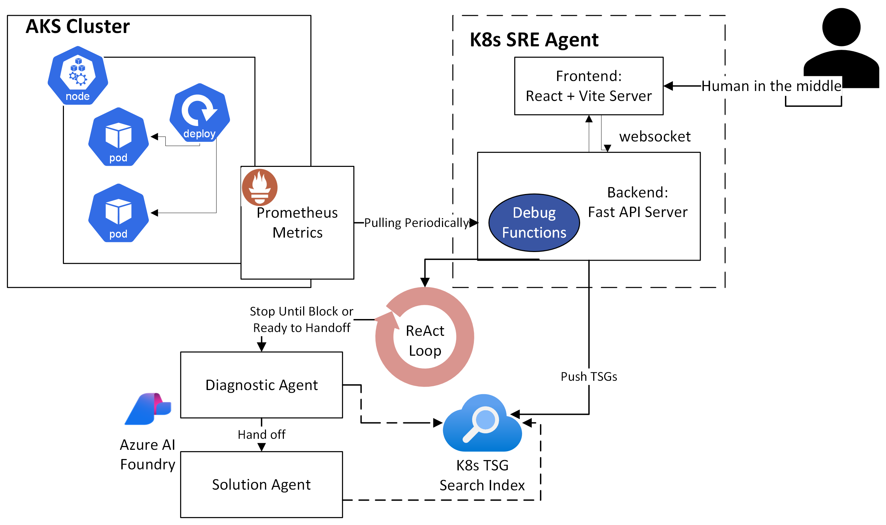
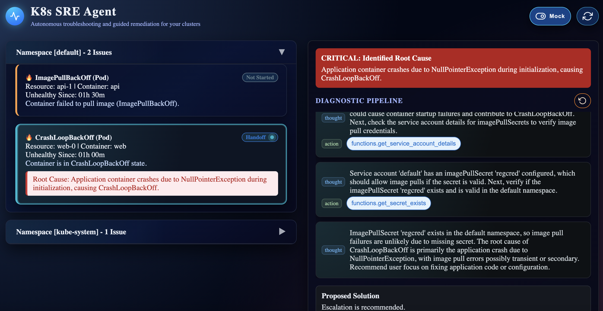

# K8s SRE Agent
AI-Powered Kubernetes Troubleshooting Agent (MVP). An AI-assisted SRE troubleshooting system that detects unhealthy Kubernetes workloads using Prometheus metrics and guides users through human-in-the-loop, ReAct-style diagnostics powered by Azure AI Foundry.

## TL;DR Demo (Intro)
<video src="docs/K8s_SRE_Agent_Intro.mp4" controls width="720">Intro Video</video>



## Project Overview

K8s SRE Agent is a project that demonstrates how AI agents can assist SREs in diagnosing Kubernetes issues.

The system:

- Continuously detects unhealthy pods and nodes via Prometheus metrics.
- Presents issues in a lightweight UI dashboard.
- Launches a step-by-step diagnostic workflow using AI agents.
- Uses TSG playbooks (Troubleshooting Guides) as RAG context.
- Keeps humans in control by requiring explicit approval before handing off the solution stage and unsure state.
- Produces a clear root cause analysis and recommended fix.
- Optionally generates an escalation summary (email/download).

This project is designed as an MVP-quality demo that balances realism, clarity, and cost efficiency.


## App Running Online

The SRE Agent app is available online at:

- [https://sreagent-frontend-dev.westus2.cloudapp.azure.com/](https://sreagent-frontend-dev.westus2.cloudapp.azure.com/)



You can use the app in two modes:

- **Mock Mode:** The UI and backend use mock data for health issues and diagnostics. This is ideal for demoing the workflow and UI without connecting to a real Kubernetes cluster.
- **Non-Mock Mode:** Deploy a few intentionally problematic pods from the `demo-apps/` directory to your cluster. The app will detect real unhealthy workloads and allow you to run diagnostics on actual cluster data.

See the [Deploy Demo Apps to Kubernetes](#deploy-demo-apps-to-kubernetes) section for setup instructions.


## Architecture
```
Prometheus ──► Health Aggregator (Code)
                   │
                   ▼
           Unhealthy Issue List (UI)
                   │
            User selects issue
                   │
                   ▼
         Diagnostic Agent (ReAct + RAG + function calling)
                   │
         (Human approval each step)
                   │
                   ▼
            Root Cause Identified
                   │
                   ▼
            Solution Agent (RAG)
                   │
                   ▼
       Fix Suggestions / Escalation
```

## Core Components
1. **Kubernetes Cluster (AKS)**
       - Azure Kubernetes Service (AKS).
       - Single system node pool (cost-optimized).
       - Demo workloads intentionally deployed in broken states.

2. **Prometheus (Metrics Source)**
       - Includes `kube-state-metrics`.
       - Detects CrashLoopBackOff, ImagePullBackOff, Pending pods.
       - Queried directly via Prometheus HTTP API.

3. **Health Aggregator (Deterministic)**
       - Pure code (no LLM).
       - Periodically queries Prometheus.
       - Builds a list of current unhealthy issues.
       - Provides structured context to AI agents.

4. **AI Agents (Azure AI Foundry)**
       - Diagnostic Agent:
              - ReAct-style loop (Think → Act → Observe).
              - Uses RAG over Kubernetes TSG playbooks and skills (`kubectl`, Prometheus queries, log fetch).
              - Stops before ambiguous state and asks for user approval.
              - Terminates when root cause confidence is reached.

5. **Solution Agent**
       - Receives full diagnostic context.
       - Generates fix recommendations and next-step guidance.
       - Optional escalation summary.

6. **UI (MVP)**
       - Lists unhealthy pods/nodes.
       - Allows user to start diagnostic flow.
       - Displays step-by-step reasoning and actions.
       - Human-in-the-loop confirmation.

## Highlights

- **Not another chatbot:** The system combines a deterministic health aggregator, ReAct agents with explicit function-calling, TSG-backed RAG, and human approval gates. It avoids open-ended chat, focuses on actionable diagnostics, and produces a clear and auditable trail of actions and observations.
- **Faster triage:** Converts Prometheus signals and cluster context into structured, step-by-step diagnostics that converge on a defensible root cause.
- **Common pod issues covered:** CrashLoopBackOff, ImagePullBackOff, Pending, OOMKilled, Liveness/Readiness failures, DNS resolution errors, volume mount issues, security policy problems, network policy blocks, init container failures, terminating/evicted states.
- **Human-in-control:** All agent actions require explicit approval; unsafe or unknown actions are denied. The system is designed for guided remediation, not autonomous changes.
- **Clear handoffs:** Produces fix suggestions and an optional escalation summary that can be shared with on-call or platform teams.

## Azure AI Search + ChatAgents Setup

This project uses Azure AI Search to index Kubernetes Troubleshooting Guides (TSGs) and Azure AI Foundry ChatAgents to retrieve and reason over them.

- Provision Azure AI Search: Create a Search service and note the endpoint and Admin key.
- Create index `sre-tsg-index`: Include fields `id`, `title`, `category`, `pod_issue`, `filepath`, `content`. Optionally add a vector field for advanced semantic retrieval.
- Ingest TSGs: Upload Markdown from `health-ui/backend/tsgs/` using the `azure-search-documents` client or an Indexer.
- Wire up ChatAgents: In Azure AI Studio Projects, add a Knowledge connection to your Search index and attach it to an Agent with Retrieval enabled.
- Configure backend: Set `AZURE_SEARCH_ENDPOINT`, `AZURE_SEARCH_INDEX`, `AZURE_SEARCH_API_KEY`, and `AZURE_AI_PROJECT_ENDPOINT` in your `.env`.

Details and a ready-to-use ingestion snippet are documented in [health-ui/backend/README.md](health-ui/backend/README.md).

## Demo Video
<video src="K8s_SRE_Agent_Demo_Audio.mp4" controls width="720"></video>

## Evaluation

- **MTTR (diagnostic):** Track median time from issue detection to confirmed root cause. Compare baselines (manual) vs with the agent enabled. Instrument timestamps at detection, agent start, key steps, and RCA confirmation.
- **Human deny rate:** Measure the percentage of agent-proposed steps that the user denies. High deny rates can indicate overreach or unclear actions; use this to tune allowed actions and prompt strategies.
- **Accuracy (RCA confirmation):** Percentage of diagnostic sessions where users confirm the agent’s proposed root cause as correct.
- **Coverage:** Share of detected issues that fall within supported pod troubleshooting scenarios and can run end-to-end diagnostics.

## Constraints

- **Scope of RAG:** The knowledge corpus and TSG references currently focus on pod-level troubleshooting. Node-level, service/ingress, storage classes, and advanced networking are limited or out of scope.
- **Diagnostic focus:** Agents primarily diagnose pod issues (containers, images, probes, DNS, mounts, policies). Non-pod resources are treated only insofar as they impact pods.
- **Metrics source:** Current unhealthy detection relies on Prometheus queries targeting pod-related states.

## Deploy Demo Apps to Kubernetes

Deploy the intentionally unhealthy demo workloads to exercise diagnostics. Use the helper scripts for a guided setup and cleanup.

- **Prerequisites:** `kubectl` configured for your cluster, permissions to create namespaces and workloads, and a non‑production environment.
- **Windows:** Run scripts via Git Bash or WSL. macOS/Linux can run them directly in a shell.

Setup (creates namespaces, prompts for each demo workload, deploys agent UI):
```bash
cd /path/to/k8sedge-sre-agent
./scripts/setup.sh
```

Verify demo workloads (expected to show unhealthy states):
```bash
kubectl get pods -n demo-apps -o wide
kubectl describe pod <pod-name> -n demo-apps
kubectl logs <pod-name> -n demo-apps --previous
```

Teardown (removes demo workloads and SRE Agent namespace):
```bash
./scripts/teardown.sh
```

Notes:
- Manifests are intentionally misconfigured to trigger issues like CrashLoopBackOff, ImagePullBackOff, Pending, OOM, and probe failures.
- Prometheus-based detection can lag slightly depending on scrape intervals.
- If your cluster enforces strict policies (PSPs, NetworkPolicies), outcomes may vary; adjust manifests as needed.


## Cost Optimization: COGS Saving Sessions

To minimize Azure COGS, the SRE Agent app is only kept online during key demo windows:

- **Active Hours:**
  - Weekdays
- **Inactive Hours:**
  - The app is stopped outside these windows to reduce costs.
  - Only the SRE Agent app (frontend/backend) is kept up; all other resources are deprovisioned or scaled down.

**Additional cost optimizations:**
- The backend uses the `gpt-4-1-mini` model, which is faster and more cost-effective than larger models, for most agent reasoning tasks.
- Token caching is enabled to avoid repeated token usage for similar prompts and responses.
- Some function/tool returns are pruned or summarized to reduce the number of tokens sent to the model, further lowering costs and improving response speed.

This schedule and architecture ensure the app is available for demos and development while keeping cloud spend low and maximizing efficiency.


## Why Use an Agent Instead of Deterministic Autoheal Scripts?

While deterministic scripts (like Autoheal) are great for well-known, recurring issues, an agent-based approach offers several advantages:

- **Scalability to Rare or Novel Questions:**
  - Agents can reason about new, previously unseen failure patterns, not just those with pre-written scripts.
- **Correlation Across Telemetry:**
  - Agents can analyze and correlate signals from logs, metrics, events, and traces, providing a holistic view.
- **Natural Language Log Analysis:**
  - Agents can interpret and summarize natural language logs, error messages, and documentation, making sense of unstructured data.
- **Human-in-the-Loop:**
  - The agent can ask for human approval or clarification when uncertain, reducing the risk of false positives or unsafe remediations.
- **Extensible Reasoning:**
  - The agent can be extended with new skills, playbooks, and data sources without rewriting core logic.

This makes the SRE Agent approach more robust for complex, evolving, or ambiguous production environments.

## TODO

1. **Enable solution agents to run fix functions:** Add gated, auditable fix function execution with strong safeguards, dry-run modes, and explicit approval requirements.
2. **Add allowed actions policy:** Define a whitelist of permitted functions/commands (e.g., `kubectl` read-only, specific patch operations), with per-environment configuration and clear UI surfacing.
3. **Trigger agents via Kubernetes CRD:** Replace the separate periodic Prometheus polling backend with a custom resource that directly triggers diagnostic/solution agents. Controllers can react to CR events, referencing Prometheus findings and cluster context.
